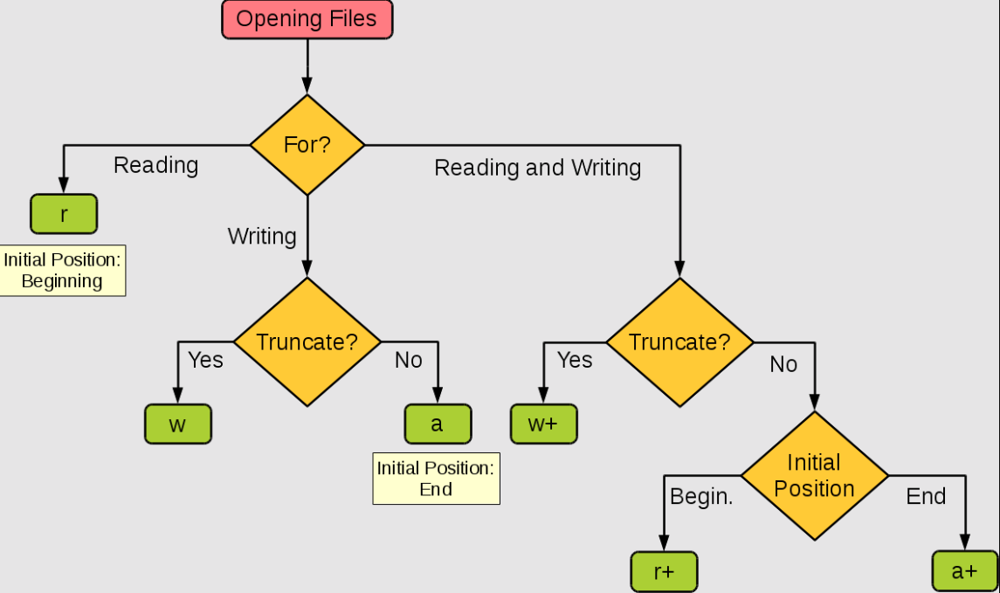

# Visão geral - Sistema administrativo em C, com escrita e leitura de arquivos

[Arquitetura do projeto](#arquitetura-do-projeto)

[Arquivos em C](#arquivos-c)
- [Modos de abertura](#modos-abertura)
- [Funções nativas](#arquivos-funcoes-nativas)

## Arquitetura do projeto <a id="arquitetura-do-projeto"></a>

### db

Folder com as informações armazenadas do sistema

### helpers.h

- Variáveis globais (path para os arquivos de armazenamento)
- Structs usadas no projeto
- Funções helpers de uso geral

### read.c

Arquivo com as operações de **leitura** da lógica de negócio (produtos e etc)

### write.c

Arquivo com as operações de **escrita** da lógica de negócio (produtos e etc)

## Arquivos em C <a id="arquivos-c"></a>

Mini guia para se trabalhar em arquivos em C.

link: https://www.geeksforgeeks.org/basics-file-handling-c/


### Modos de abertura de arquivos: <a id="modos-abertura"></a>

A seguinte imagem lista todos os modos para **abertura** de arquivos em C, que diz respeito a como as operações serão feitar **dentro do arquivo**.

- r - abre um arquivo em read mode (modo de leitura).
- w - abre e cria um arquivo de texto em modo de escrita.
- a - abre um arquivo em append mode (aponta para o fim do arquivo, ou seja, vai concatenar, inserir ao fim do arquivo).
- r+ - abre um arquivo em modo de leitura e escrita.
- a+ - abre um arquivo em append mode e leitura. Se não existir arquivo cria um.
- w+ - se o arquivo existir vai sobescrever o conteúdo. Se não existir cria um novo.



### Arquivos funções nativas <a id="arquivos-funcoes-nativas"></a>

#### Abrindo um arquivo:

Função: ```fopen()```

Exemplo:

```c
#include <stdio.h>

int main() {
    FILE *fptr = fopen("example.txt", "r");
    if (fptr == NULL) {
        printf("Erro ao abrir o arquivo.\n");
        return 1;
    }
    printf("Arquivo aberto com sucesso.\n");
    fclose(fptr); // precisa fechar o arquivo
    return 0;
}
```

Abre um arquivo

#### Lendo de um arquivo

Funções: ```fscanf()``` ou ```fgets()```

Exemplo:

```c
int main() {
    FILE *fptr = fopen("example.txt", "r");
    char line[100];

    if (fptr == NULL) {
        printf("Erro ao abrir o arquivo.\n");
        return 1;
    }

    fgets(line, sizeof(line), fptr); // le a primeira linha (de até 100 caracteres)
    printf("Conteúdo: %s\n", line);

    fclose(fptr);
    return 0;
}
```

#### Escrevendo em um arquivo

Funções: ```fprintf()``` ou ```fputs()```

Exemplo:

```c
#include <stdio.h>

int main() {
    FILE *fptr = fopen("example.txt", "w");

    if (fptr == NULL) {
        printf("Erro ao abrir o arquivo.\n");
        return 1;
    }

    fprintf(fptr, "Escrevendo este texto no arquivo.\n");
    fclose(fptr);
    return 0;
}
```

#### Movendo para um ponto específico do arquivo

Funções: ```fseek()``` ou ```rewind()```

Exemplo:

```c
#include <stdio.h>

int main() {
    FILE *fptr = fopen("example.txt", "r");
    
    if (fptr == NULL) {
        printf("Erro ao abrir o arquivo.\n");
        return 1;
    }

    fseek(fptr, 10, SEEK_SET);  // Move para o décimo byte do arquivo

    char ch = fgetc(fptr);
    printf("Caractere na posição 10: %c\n", ch);

    fclose(fptr);
    return 0;
}
```

Movendo para o **fim do arquivo**:


```c
#include <stdio.h>

int main() {
    FILE *fptr = fopen("example.txt", "r");
    
    if (fptr == NULL) {
        printf("Erro ao abrir o arquivo.\n");
        return 1;
    }

    fseek(fptr, 0, SEEK_END);  // Move o ponteiro para o ÚLTIMO CARACTERE do arquivo (tamanho do arquivo)

    char ch = fgetc(fptr);
    printf("Último caracetere: %c\n", ch);

    fclose(fptr);
    return 0;
}
```

#### Fechando o arquivo

Funções: ```fclose()```

Exemplo:

```c
#include <stdio.h>

int main() {
    FILE *fptr = fopen("example.txt", "r");

    if (fptr != NULL) {
        fclose(fptr);
        printf("Arquivo fechado com sucesso.\n");
    }

    return 0;
}

```